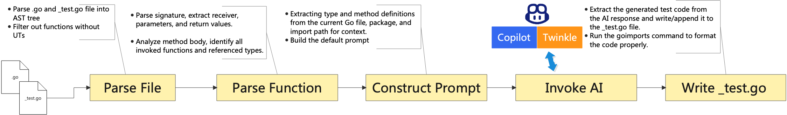

# Smart-Testify

Smart-Testify is a tool that generates unit test files for Go code using AI. It supports various commands for configuring settings, managing prompts, and generating tests. Below is a concise overview of the commands and usage.

# Demo
[](https://www.bilibili.com/video/BV13MsWzaE3W/)


## Table of Contents

- [Installation](#installation)
- [Usage](#usage)
- [Commands](#commands)
- [Flags](#flags)
- [Examples](#examples)
- [Contributing](#contributing)
- [License](#license)

## Installation

Smart-Testify can be installed by downloading the latest release or building from source.

Clone the repository, go into the root folder and run
```bash  
make install
```  
Note that, `smart-testify` depends on `goimports`, it will be installed automatically if you don't have it.

## Quick Start
Then follow below steps to use it
1. Setup token for Copilot
```bash
smart-testify config copilot init-token
```
2. Create prompt used to guide the AI how to generate the test code. 
```bash
smart-testify config prompt add <your-prompt-name>
```
3. Generate UT
```bash
smart-testify generate <file/folder>
```


## Usage
### Commands

#### `config`
Configure settings.

- **`use`**: Set the AI model to use (`copilot` or `twinkle`). If `copilot` is chosen, you need to run `smart-testify config copilot init-token` before using it.
- **`show`**: Display current configuration.
- **`prompt`**: Manage prompts for test generation.
  - **`list`**: List all available prompts.
  - **`show <name>`**: Show content of a specific prompt.
  - **`edit <name>`**: Edit a specific prompt.
  - **`add <name>`**: Create a new prompt.
  - **`remove <name>`**: Remove a prompt.
  - **`set-default <name>`**: Set which prompt is the default.

#### `generate`
Generate unit test files for Go code.

- **`generate <file/folder>`**: Generate tests for a specified Go file or directory.
  - **`--mode`** (`-m`): Mode for test generation (`append` or `skip`). Defaults to `append`.
  - **`--filter`** (`-f`): Regex filter for functions to generate tests for. Wildcard is supported, but you need to wrap it in quotes. For example `-f "Test*"`.
  - **`--granularity`** (`-g`): Granularity of test generation (`file` or `function`).
  - **`--ignore-error`** (`-c`): Continue processing if an error occurs. Defaults to `false`.

## Examples

1. **Set the AI model to Twinkle**:
```bash  
 smart-testify config use twinkle  
```  

2. **Generate tests for a Go file**:
```bash  
 smart-testify generate <file/folder>
```  

3. **Add the prompt for test case generation**:
```bash  
 smart-testify config prompt add <prompt-name>
```  
4. **Set default prompt for test case generation**:
```bash  
 smart-testify config prompt set-default <prompt-name>
```  

## How does it work


## Q&A

### How does Smart-Testify check if a test function already exists?

Smart-Testify uses a systematic approach to check for existing test functions:

1. **Test Function Naming**: For a given method, it generates the test function name using this pattern:
   - For methods with receivers: `Test[ReceiverType]_[MethodName]`
   - For standalone functions: `Test[FunctionName]`
   The first letter of the method name is automatically capitalized.

2. **Existence Check**: When processing a test file:
   - The tool parses the existing test file using Go's AST (Abstract Syntax Tree)
   - It looks for all function declarations that start with "Test"
   - These functions are stored in a map with their names as keys
   - When generating a new test, it checks this map to see if the test function name already exists

### Can I generate tests for specific functions only?

Yes, you can use the `--filter` (`-f`) flag with a regex pattern to generate tests for specific functions. For example:
- `--filter "Create.*"` will generate tests for all functions starting with "Create"
- `--filter "^Get"` will generate tests for all functions starting with "Get"
- `--filter "User$"` will generate tests for all functions ending with "User"

### What happens if there's an error during generation?

By default, when Smart-Testify is processing multiple fils, it will stop processing when it encounters an error. However, you can use the `--ignore-error` (`-c`) flag to continue processing other files/functions even if some fail.

## Contributing

Contributions are welcome! If you find any bugs or want to add new features, please fork the repository, make changes, and create a pull request. Before submitting your pull request, ensure that you have run all tests and followed the coding style guidelines.

## License

Smart-Testify is licensed under the MIT License. See [LICENSE](LICENSE) for more details.
